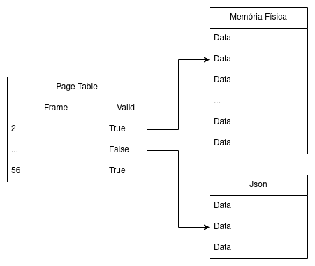

# VirtualMemoryManager

Repositório criado para o projeto final da disciplina de Sistemas Operacionais.

O projeto consiste em um gerenciador de memória virtual levando em conta os
seguintes conceitos:

- Memória física de 64kB, logo 256 frames
- Não é necessário utilizar TLB
- Endereços possuem 16 bits (8 para page number e 8 para page offset)
- Ler page faults de algum arguivo (JSON, csv, etc)

## Projeto do Sistema

O sistema foi projetado da seguinte forma simplificada:

 
